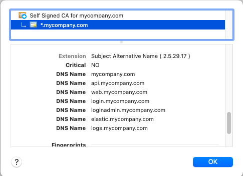

# OAuth Development Certificates

Self signed certificates for use with OAuth code samples, created via `makeCerts.sh` scripts.\
In each case a root authority creates a wildcard certificate with multiple subject alternative names.

## Architecture

The goal is to represent a real world OAuth architecture on a Developer PC.\
This can be very useful for designing deployment early and understanding SSL trust issues.

| Component | Base URL | Represents |
| --------- | -------- | ---------- |
| APIs | https://api.mycompany.com | The base URL for microservices |
| Web | https://web.mycompany.com | The base URL for web apps |
| Authorization Server | https://login.mycompany.com | The Authorization Server address |

Follow the same conventions for less central components, some of which may be internal URLs:

| Component | Base URL | Represents |
| --------- | -------- | ---------- |
| Mobile | https://mobile.mycompany.com | Used for deep linking and hosting assets files |
| Admin | https://loginadmin.mycompany.com | The URL to administer the Authorization Server |
| Authorization Server | https://logs.mycompany.com | The URL used to access aggregated logs |

## SSL Certificates

These are issued by a Root CA which can be trusted by apps as explained in the [SSL Blog Post](https://authguidance.com/2017/11/11/developer-ssl-setup/).\
A single wildcard certificate is used, for ease of administration.\
Each distinct URL is included as a subject alternative name, which is sometimes needed for SSL trust to work.

## URLs for Components under Development

When running a component on localhost I use these URLs:

- https://api.mycompany.com
- https://web.mycompany.com
- https://login.mycompany.com

## Docker Internal URLs

When using SSL inside a Docker Compose network I use URLs for controllable docker host names:

- https://sampleapi.mycompany.internal
- https://webhost.mycompany.internal
- https://login.mycompany.internal

## Kubernetes Internal URLs

When using SSL inside a Kubernetes network I use base URLs of the form `svc.default.cluster.local`.\
In this case the certificates are issued by [certmanager](https://cert-manager.io/docs/) and its CA issuer:

- https://sampleapi-svc.default.svc.cluster.local
- https://webhost-svc.default.svc.cluster.local
- https://login-svc.default.svc.cluster.local

## Istio URLs

At a later date I may switch to [Istio](https://istio.io/) as the preferred Kubernetes setup.\
In this case sidecars must be used to call between containers and Mutual TLS is used.\
All of the infrastructure security is then externalised and managed automatically.

## Serverless Internet URLs

I follow the same model for an AWS deployed system, where AWS Certificate Manager issues the certificates:

- https://api.authsamples.com
- https://web.authsamples.com
- https://login.authsamples.com
