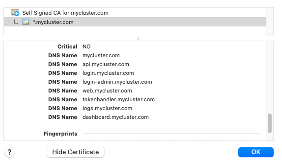

# OAuth Development Certificates

Development certificates for use with my blog's OAuth code samples.\
Wildcard certificates are used so that there is a single certificate to manage.\
Real certificates should of course not be checked into a public repository like this.

## *.mycompany.com

These are my default local computer domains for testing of early SPA and API code samples:


## *.authsamples-dev.com

A setup where the web subdomain runs locally and API subdomains are deployed components in AWS:


## *.mycluster.com

A setup where components are deployed to a local Kubernetes cluster:



## Certification Creation

Certificates can be recreated when required with one of these commands:

```bash
./makecerts.sh mycompany
./makecerts.sh authsamples-dev
./makecerts.sh mycluster
```

## Further Information

See the [Development SSL Setup](https://authguidance.com/2017/11/11/developer-ssl-setup/) blog post for further details on local setups.
