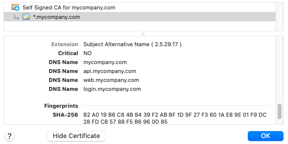
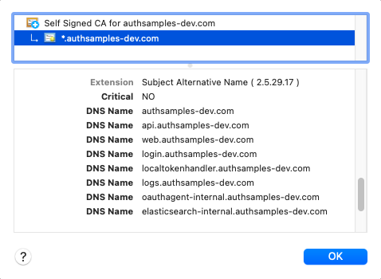

# OAuth Development Certificates

Development certificates for use with my blog's OAuth code samples.\
Wildcard certificates are used so that there is a single certificate to manage.

# *.mycompany.com

This are my default local computer domains for testing of early code samples.\
I also use this for external URLs in local Kubernetes deployments.

# *.authsamples-dev.com

This is a more complex setup, where the tokenhandler subdomain is deployed to AWS.\
This enables me to run the final Single Page App locally with only the React code.

