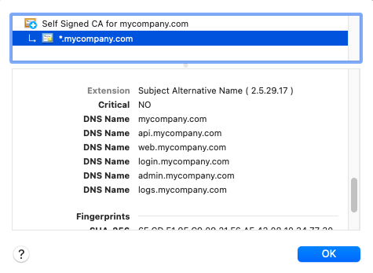

# OAuth Development Certificates

Self signed certificates for use with OAuth code samples

## Local PC

On the local PC we use certificates with these URLs:

- https://api.mycompany.com
- https://web.mycompany.com
- https://login.mycompany.com

The following wildcard certificate is used:

## Kubernetes

In Kubernetes Minikube we use certificates with these URLs:

- https://api.mycluster.com
- https://web.mycluster.com
- https://login.mycluster.com

The following wildcard certificate is used:

## Creation

The makeCerts.sh script was used to invoke openssl to create the certificates:

If required, create certificates for your own domains by editing the 'extended/server.ext' file.
The makeCerts.sh script can then be run in a MacOS terminal or in Git Bash on Windows. 

## Configuring SSL Trust

Applications then need to trust the ca.pem files:

See the [Blog Post](https://authguidance.com/2017/11/11/developer-ssl-setup/) for instructions on how to do this for various technologies
